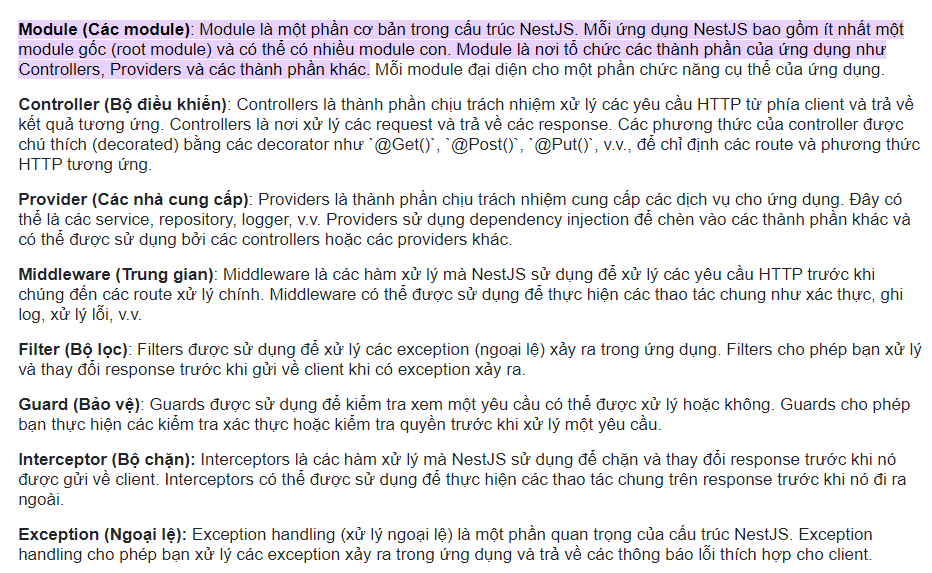

## 1 Các thành phần
[giải thích](https://stringee.com/vi/blog/post/nestjs-la-gi#:~:text=Module%20(C%C3%A1c%20module)%3A%20Module,v%C3%A0%20c%C3%A1c%20th%C3%A0nh%20ph%E1%BA%A7n%20kh%C3%A1c.)
<br>


## Note
- [doc học nest](https://wanago.io/2020/05/11/nestjs-api-controllers-routing-module/)
- route ứng với tên controller và phương thức trong controller (như định nghĩa route trong web.php kèm theo controller)
```ts
@Controller('post')

@Get('') -> route: /post
@Post('/create') -> route: /post/create
```
- Controller -> Service
- Cần tạo **dto** để chứa các thông tin truyền vào body lúc `create` hoặc `update`
- Entity (có thể làm theo interface trong hướng dẫn) nó giống như model trong laravel